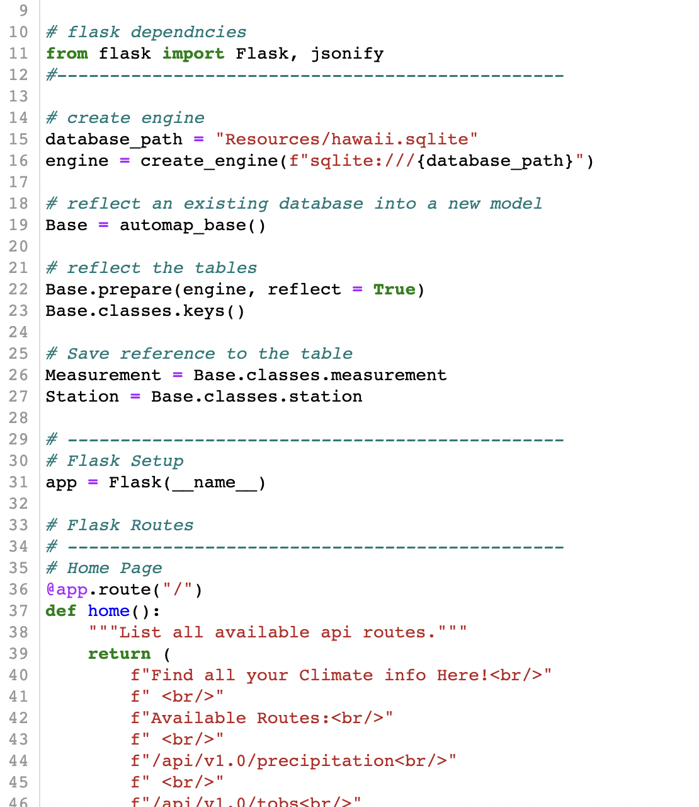

Summary/Problem: This repo contains an analysis on climate findings. It utilized Jupyter Notebooks/Pandas and a Flask app.py utilizing SQLalchemy. The Flask (app.py) helps create a website that will display weather results from the database. It can display weather results from a range of dates as selected by the user. The jupyter notebook is used for data exploration to review precipitation over time and ranges of temperatures.

See Flask/app.py webpage output below when selecting dates which provides the average temp over that time and the min/max temps during that time.

Please note that the repo consists of the following:

+ climate_submittal.ipynb
    + This is the jupyter notebook for Part 1: Climate Analysis and exploration that consists of the precipitation analysis, station analysis, and supplemental graphs. Also utilizes datetime as dt to help with date analysis.
    

+ app.py
    + This is the python file that runs the Part 2: Designing of the climate app.
    
+ Resources folder - contains the provided SQL files used for queries in this assignment.
